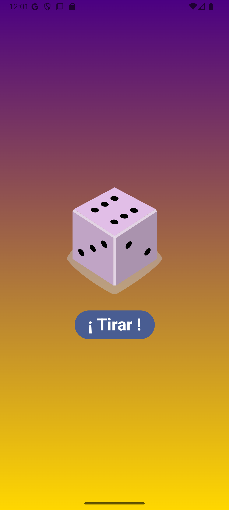
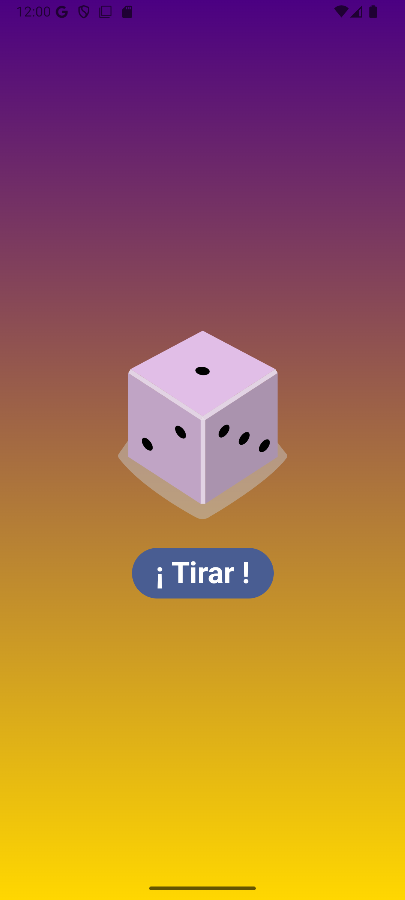
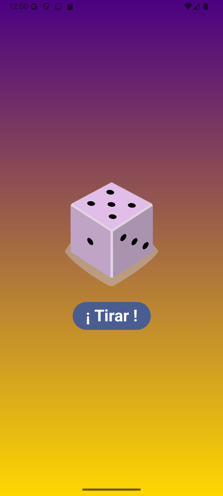
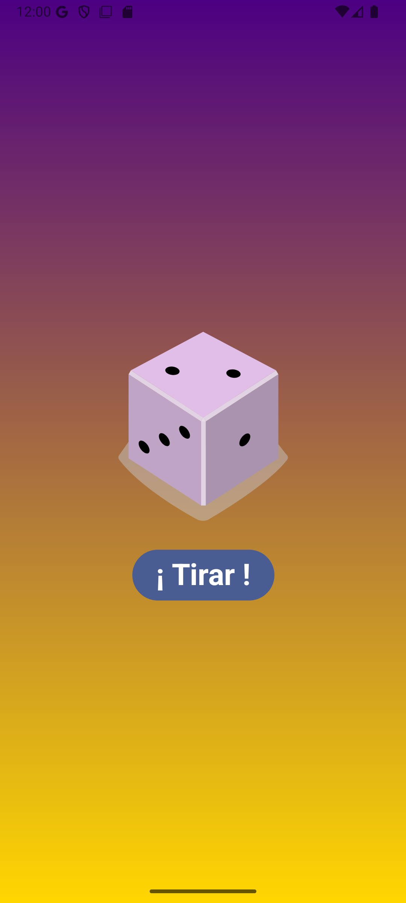
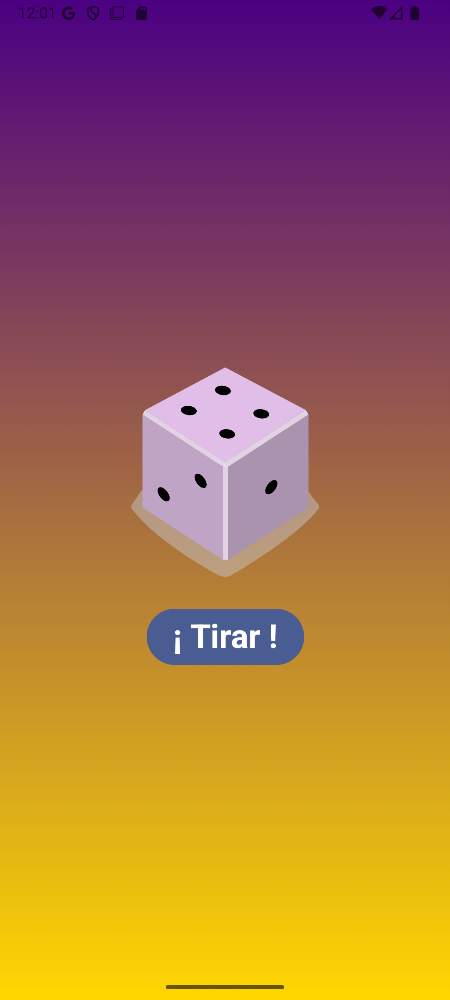

# LanzaDados
LanzaDados es una aplicación simple pensada para quien busque lanzar un dado de 6 caras y no tenga uno físico o  lo haya perdido en su ultima partida de Katan. Es una interfaz simple y divertida: ¡podrás tirar el dado con solo presionar un botón! Ideal para juegos de mesa y actividades de azar que requieran un poco de suerte!!.

 &nbsp;&nbsp;     &nbsp;&nbsp;       &nbsp;&nbsp;&nbsp; 

## Tecnologías

- **Kotlin**
- **Jetpack Compose** 
- **Material Design**

---
